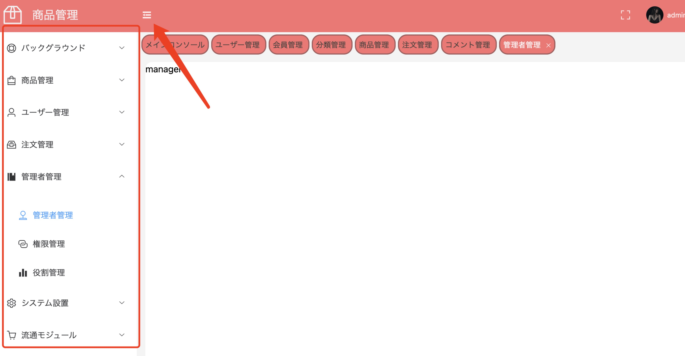
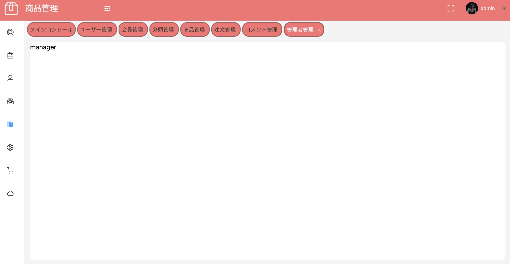

## sub-componentとsub-componentとの関連をつける方法

普通には、父componentと子componentとの関連はdefineEmits,defineProps,defineExpose三つの方法で実現するが、子componentと子component
との関連をする方法はどうなるか？

## 問題

上のheaderと右のmenuはhome.vueに所属する二つの子componentである、そして、今は上のボータンを使って、右のメーニューをコントロールしたいです。

展開した場合



展開していない場合



## 解決対策

> vite-project/src/layout/MyAside.vue
```javascript
defineProps({
    collapse: {
        type: Boolean,
        default: false,
    },
});
```
menuのある子componentには、menuの展開をコントロールする変量collapseを提供する

> vite-project/src/components/home.vue
```js
const collapse = ref(false);
function menu_close_open(collapse_value) {
    collapse.value = collapse_value;
}
```

```html
<my-header @menu_close_open="menu_close_open"></my-header>
<my-aside :collapse="collapse"></my-aside>

```
そして、父componentでは、その変量を作って、変量の変更する方法をmy-headerという子componentに提供する。

> vite-project/src/layout/MyHeader.vue

```html
<div v-if="isexpand" class="icon-box" @click="menu_close_open(true)">
    <el-icon>
        <Fold />
    </el-icon>
</div>

```

そして、myheaderという子componentはこの方法を使って、メーニューの展開をコントロールできるとなります。
